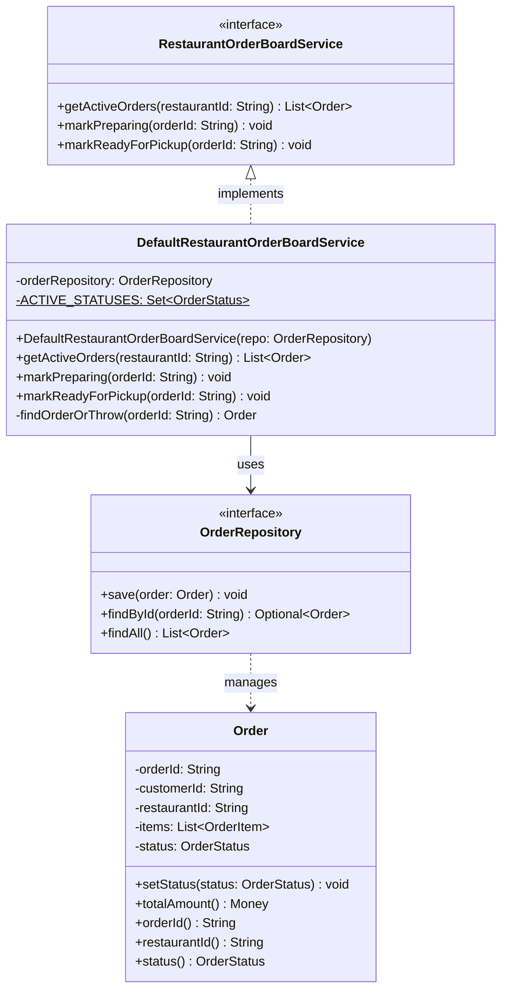
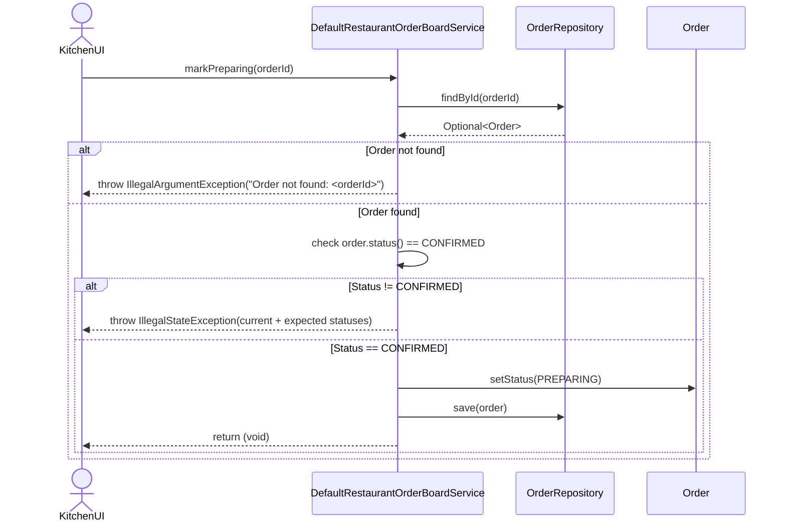
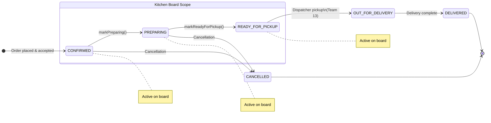

# UML Diagrams – Restaurant Order Board
### Team 10 – PSV (Public Static Void) | OOAD Mini Project | PES University

---

## 7. Class Diagram

### Legend

| Notation      | Meaning                          |
|---------------|----------------------------------|
| `<<interface>>`| Java interface                  |
| `<\|..`        | Implements (realization)         |
| `-->`         | Depends on / uses                |
| `$`           | Static member                    |

---

## 8. Sequence Diagram – Kitchen Status Update Flow (`markPreparing`)

---

## State Machine – Order Status Lifecycle (Kitchen Scope)

---

*Team PSV (Public Static Void) – Restaurant Order Board | OOAD Mini Project | PES University*
